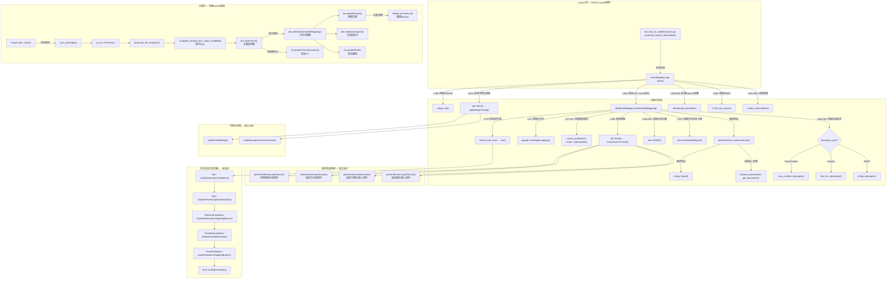

# DCL-SLAM 启动逻辑深度分析

## 1. 启动链路梳理

### 1.1 入口层：Launch 文件

**文件**: `src/dcl_slam/launch/dcl_fast_lio_mid360.launch.py`

| 函数 | 位置 | 调用方式 | 说明 |
|------|------|---------|------|
| `generate_launch_description()` | launch.py:10 | 间接调用（ROS2 launch框架反射加载） | ROS2 launch入口函数，框架通过模块导入自动调用 |
| `get_package_share_directory('dcl_slam')` | launch.py:11 | 直接调用 | 获取dcl_slam包的share目录路径 |
| `Node(package='dcl_fast_lio', executable='fastlio_mapping')` | launch.py:22 | 直接调用（声明式配置） | 声明fastlio_mapping节点，namespace='/a' |
| `Node(package='rviz2', executable='rviz2')` | launch.py:35 | 直接调用（声明式配置，条件触发） | 声明RViz节点，受rviz参数控制 |

Launch文件触发的核心可执行文件：**`fastlio_mapping`**（即 `laserMapping.cpp` 编译产物）

---

### 1.2 主进程层：laserMapping.cpp

**文件**: `src/dcl_fast_lio/src/laserMapping.cpp`

| 函数 | 位置（行号） | 调用方式 | 说明 |
|------|-------------|---------|------|
| `main()` | :796 | 直接调用（进程入口） | 整个系统的C++入口 |
| `rclcpp::init()` | :798 | 直接调用 | 初始化ROS2运行时 |
| `distributedMapping::distributedMapping()` | :801 | 直接调用（构造函数） | 创建dm对象，触发完整的DCL-SLAM初始化链 |
| `distributedMapping::globalMapThread()` | :813 | 间接调用（std::thread启动） | 全局地图可视化线程 |
| 参数声明与加载 (declare_parameter/get_parameter) | :816-882 | 直接调用 | 加载FastLIO相关参数 |
| `p_imu->set_extrinsic()` / `set_gyr_cov()` 等 | :908-912 | 直接调用 | 设置IMU处理器参数 |
| `kf.init_dyn_share()` | :916 | 直接调用 | 初始化迭代卡尔曼滤波器 |
| `livox_pcl_cbk()` / `standard_pcl_cbk()` | :941/:946 | 间接调用（ROS2订阅回调） | 点云数据回调 |
| `imu_cbk()` | :950 | 间接调用（ROS2订阅回调） | IMU数据回调 |
| `sync_packages()` | :974 | 直接调用（主循环内） | 同步LiDAR和IMU数据包 |
| `p_imu->Process()` | :993 | 直接调用 | IMU数据处理与预积分 |
| `lasermap_fov_segment()` | :1007 | 直接调用 | 视场内地图分割 |
| `kf.update_iterated_dyn_share_modified()` | :1071 | 直接调用 | 迭代EKF状态估计 |
| `dm.saveFrame()` | :1087 | 直接调用 | 判断是否为关键帧 |
| `dm.performDistributedMapping()` | :1093 | 直接调用 | 执行分布式建图核心逻辑 |
| `dm.updatePoses()` | :1095 | 直接调用 | 更新位姿估计 |
| `dm.makeDescriptors()` | :1147 | 直接调用 | 生成全局描述子 |
| `dm.publishPath()` | :1149 | 直接调用 | 发布路径 |
| `dm.publishTransformation()` | :1151 | 直接调用 | 发布TF变换 |
| `publish_odometry()` | :1155 | 直接调用 | 发布里程计 |
| `map_incremental()` | :1159 | 直接调用 | 增量式地图更新 |

---

### 1.3 DCL-SLAM 核心初始化链

#### 1.3.1 paramsServer 构造函数

**文件**: `src/dcl_slam/src/paramsServer.cpp:11`

| 步骤 | 说明 |
|------|------|
| 解析namespace获取机器人ID | 从ROS2 namespace提取机器人名称和ID（如 `/a` → id=0） |
| 加载全部参数 | 通过 `declare_parameter` + `get_parameter` 加载60+配置参数 |
| 参数验证 | number_of_robots < 1 或 sensor 类型非法时调用 `rclcpp::shutdown()` |

#### 1.3.2 distributedMapping 构造函数

**文件**: `src/dcl_slam/src/distributedMappingBasis.cpp:17`

继承 `paramsServer`，构造函数链：`distributedMapping() → paramsServer("dcl_slam_node") → rclcpp::Node("dcl_slam_node")`

| 步骤 | 位置（行号） | 说明 |
|------|-------------|------|
| `google::InitGoogleLogging()` | :20 | 初始化日志系统 |
| 创建机器人通信接口（循环） | :27-122 | 为每个机器人创建pub/sub（描述子、回环、优化状态等） |
| 创建可视化发布者 | :126-143 | 全局地图、路径、关键帧点云等 |
| 初始化降采样滤波器 | :149-153 | 设置各类VoxelGrid参数 |
| 初始化描述子 | :166-183 | 根据配置创建ScanContext/LidarIris/M2DP |
| 初始化噪声模型 | :194-195 | 里程计和先验因子噪声 |
| 初始化iSAM2 | :198-201 | 创建本地位姿图优化器 |
| 初始化DistributedMapper | :207-271 | 创建分布式优化器并配置参数 |
| 启动定时器线程 `run()` | :275 | `create_wall_timer` 定时触发分布式优化状态机 |
| 启动回环检测线程 | :280 | `std::thread` 启动 `loopClosureThread()` |

---

### 1.4 运行时线程与回调

#### 主线程（main循环 @laserMapping.cpp:970）
```
while(rclcpp::ok()) → spin_some → sync_packages → IMU处理 → EKF → DCL-SLAM处理
```

#### 回环检测线程（loopClosureThread @distributedLoopClosure.cpp:674）
```
循环执行：performRSIntraLoopClosure → performIntraLoopClosure → performInterLoopClosure → performExternLoopClosure
```

#### 分布式优化定时器（run @distributedMapping.cpp:1444）
```
状态机：Idle → Start → Initialization → RotationEstimation → PoseEstimationInitialization → PoseEstimation → End → PostEndingCommunicationDelay → Idle
```

#### 全局地图可视化线程（globalMapThread @distributedMappingVisualization.cpp:6）
```
循环执行：publishGlobalMap → publishLoopClosureConstraint
```

#### ROS2 回调（间接调用，消息驱动）
- `globalDescriptorHandler()` — 接收其他机器人描述子
- `loopInfoHandler()` — 接收回环信息
- `optStateHandler()` / `rotationStateHandler()` / `poseStateHandler()` — 优化状态同步
- `neighborRotationHandler()` / `neighborPoseHandler()` — 邻居估计值

---

## 2. 函数关系可视化（Mermaid）



---

## 3. 关键函数说明

### 3.1 启动前（进程启动 → 主循环开始之前）

| 函数 | 文件:行号 | 执行时机 | 前置条件 | 异常处理 |
|------|----------|---------|---------|---------|
| `generate_launch_description()` | launch.py:10 | 进程启动前 | dcl_slam包已安装、config文件存在 | 文件不存在则launch框架报错，进程不启动 |
| `main()` | laserMapping.cpp:796 | 进程入口 | ROS2环境可用 | namespace非法(长度≠2)会shutdown并return 1 |
| `rclcpp::init()` | laserMapping.cpp:798 | 最先执行 | 无 | 失败则后续所有ROS2调用崩溃 |
| `paramsServer::paramsServer()` | paramsServer.cpp:11 | 构造dm时 | rclcpp::init完成 | `number_of_robots_<1`或sensor非法 → `rclcpp::shutdown()`，**但不会抛出异常**，进程可能继续运行在异常状态 |
| `distributedMapping::distributedMapping()` | distributedMappingBasis.cpp:17 | 构造dm时 | paramsServer构造完成 | google::InitGoogleLogging失败不阻断启动；描述子类型非法时已在paramsServer中关闭inter_loop |
| `google::InitGoogleLogging()` | distributedMappingBasis.cpp:20 | 构造时 | HOME环境变量存在 | 日志目录不存在可能导致日志写入失败但不阻断 |
| `new ISAM2()` | distributedMappingBasis.cpp:201 | 构造时 | 无特殊前置 | 内存分配失败会抛std::bad_alloc |
| `new DistributedMapper()` | distributedMappingBasis.cpp:208 | 构造时 | 无特殊前置 | 同上 |
| `kf.init_dyn_share()` | laserMapping.cpp:916 | 参数加载后 | EKF模型函数(get_f, df_dx等)已定义 | 无显式异常处理 |
| 注册订阅回调 (create_subscription) | laserMapping.cpp:936-950 | 参数加载后 | topic名称正确 | 订阅失败不会阻断，但无数据进入主循环 |

### 3.2 启动中（主循环运行期间，每帧触发）

| 函数 | 文件:行号 | 执行时机 | 前置条件 | 异常处理 |
|------|----------|---------|---------|---------|
| `sync_packages()` | laserMapping.cpp:392 | 每次spin_some后 | LiDAR和IMU数据到达 | 数据不足返回false，跳过该帧 |
| `p_imu->Process()` | laserMapping.cpp:993 | 数据包同步后 | IMU数据有效 | 空点云会导致跳过(continue) |
| `kf.update_iterated_dyn_share_modified()` | laserMapping.cpp:1071 | 特征点足够时 | feats_down_size ≥ 5 | 点数不足时跳过 |
| `dm.saveFrame()` | distributedMapping.cpp:488 | EKF完成后 | keyposes_cloud_6d可用 | 第一帧直接返回true |
| `dm.performDistributedMapping()` | distributedMapping.cpp:374 | saveFrame返回true | 关键帧点云和位姿有效 | 无显式异常处理，iSAM2 update可能内部报错 |
| `dm.updatePoses()` | distributedMapping.cpp:548 | performDistributedMapping后 | isam2估计完成 | 返回bool，false时不重建ikd-tree |
| `dm.makeDescriptors()` | distributedMapping.cpp:609 | 关键帧处理完成后 | 关键帧点云已存储 | 描述子未初始化时(类型非法)不执行 |
| `dm.publishPath()` | distributedMapping.cpp:657 | 描述子生成后 | 路径数据已更新 | 无订阅者时仍发布（低开销） |
| `dm.publishTransformation()` | distributedMapping.cpp:680 | 每帧都执行 | 无特殊前置 | 无显式异常处理 |

### 3.3 启动后（独立线程持续运行）

| 函数 | 文件:行号 | 执行时机 | 前置条件 | 异常处理 |
|------|----------|---------|---------|---------|
| `loopClosureThread()` | distributedLoopClosure.cpp:674 | 构造完成后持续运行 | intra/inter回环使能至少一个 | 两者都禁用时直接return终止线程 |
| `performRSIntraLoopClosure()` | distributedLoopClosure.cpp | 回环线程每轮 | 至少有若干关键帧 | 关键帧不足时早期返回 |
| `performIntraLoopClosure()` | distributedLoopClosure.cpp | 回环线程每轮 | 描述子已初始化 | 无匹配时跳过 |
| `performInterLoopClosure()` | distributedLoopClosure.cpp | 回环线程每轮 | 收到其他机器人描述子 | 无候选时跳过 |
| `performExternLoopClosure()` | distributedLoopClosure.cpp | 回环线程每轮 | loop_closures_candidates非空 | ICP失败(fitness>阈值)时丢弃候选 |
| `run()` (分布式优化状态机) | distributedMapping.cpp:1444 | 定时器触发(mapping_process_interval_) | global_optmization_enable_=true | Idle状态下条件不满足则保持Idle；failSafeCheck可中止优化 |
| `globalMapThread()` | distributedMappingVisualization.cpp:6 | 构造完成后持续运行 | 无 | initial_values为空或无订阅者时早期返回 |

### 3.4 关键异常/容错机制总结

1. **参数验证失控**: `paramsServer`中`rclcpp::shutdown()`不会立即终止进程，后续代码仍会继续执行，可能导致未定义行为。
2. **线程安全**: `lock_on_call` mutex已被注释掉（预留接口），当前`lockOnCall()`/`unlockOnCall()`为空操作。
3. **优化超时保护**: `failSafeCheck()`机制在`fail_safe_steps_`步后中止优化，防止分布式优化死锁。
4. **回环验证**: ICP `fitness_score_threshold_` + PCM (Pairwise Consistency Maximization) 双重过滤防止错误回环。
5. **描述子降级**: descriptor_type非法时自动关闭inter_robot回环，不会崩溃。
